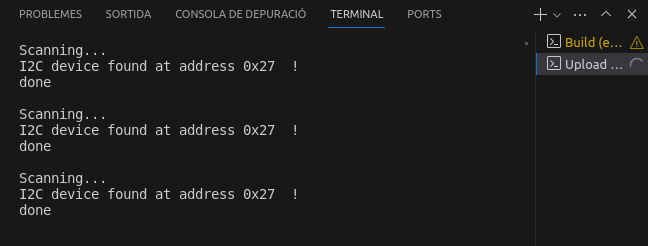
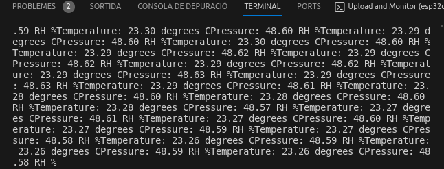

# PRACTICA 5: BUSOS DE COMUNICACIÓ 1
### Autor: Tomàs Lloret

L'objectiu d'aquesta pràctica és entendre com funcionen els busos de comunicació entre periférics. Farem quatre pràctiques on veurem els busos I2C, SPI, I2S i USART respectivament.

## Part A: Escàner I2C
Inicialitzem les llibreries necessaries per al funcionament del projecte.
```c
#include <Arduino.h>
#include <Wire.h>
```

Dins del setup establim la velocitat de comunicació del dispositiu i escrivim les funcions que realitzaràn la connexió entre el microcontrolador i l'escàner I2C.
```c
void setup()
{
  Wire.begin();
  Serial.begin(115200);
  while (!Serial);           
  Serial.println("\nI2C Scanner");
}
```

I finalment en el loop realitzem la funció que busca l'escàner i informa pel terminal de l'estat d'aquest i de la localització del port en el que es troba, si està connectat.
```c
void loop()
{
  byte error, address;
  int nDevices;
 
  Serial.println("Scanning...");
 
  nDevices = 0;
  for(address = 1; address < 127; address++ )
  {
    Wire.beginTransmission(address);
    error = Wire.endTransmission();
 
    if (error == 0)
    {
      Serial.print("I2C device found at address 0x");
      if (address<16)
        Serial.print("0");
      Serial.print(address,HEX);
      Serial.println("  !");
 
      nDevices++;
    }
    else if (error==4)
    {
      Serial.print("Unknown error at address 0x");
      if (address<16)
        Serial.print("0");
      Serial.println(address,HEX);
    }    
  }
  if (nDevices == 0)
    Serial.println("No I2C devices found\n");
  else
    Serial.println("done\n");
 
  delay(5000); 
}
```

### Part A: Codi complet
```c
#include <Arduino.h>
#include <Wire.h>


void setup()
{
  Wire.begin();
  Serial.begin(115200);
  while (!Serial);           
  Serial.println("\nI2C Scanner");
}
 
 
void loop()
{
  byte error, address;
  int nDevices;
 
  Serial.println("Scanning...");
 
  nDevices = 0;
  for(address = 1; address < 127; address++ )
  {
    Wire.beginTransmission(address);
    error = Wire.endTransmission();
 
    if (error == 0)
    {
      Serial.print("I2C device found at address 0x");
      if (address<16)
        Serial.print("0");
      Serial.print(address,HEX);
      Serial.println("  !");
 
      nDevices++;
    }
    else if (error==4)
    {
      Serial.print("Unknown error at address 0x");
      if (address<16)
        Serial.print("0");
      Serial.println(address,HEX);
    }    
  }
  if (nDevices == 0)
    Serial.println("No I2C devices found\n");
  else
    Serial.println("done\n");
 
  delay(5000); 
}
```

### Part A: Funcionament


En aquesta imatge veiem els prints del terminal on es dona l'adreça on es detecta la pantalla.

## Part B: Connexió amb un sensor
Inicialitzem les llibreries necessaries per al funcionament del projecte, també inicialitzem el display LiquidCrystal_I2C i definim la variable "aht" amb la següent sintaxi.
```c
#include <Arduino.h>
#include <SPI.h>
#include <Wire.h>
#include <Adafruit_GFX.h>
#include <Adafruit_SH110X.h>
#include <Adafruit_AHTX0.h>
#include <Fonts/FreeSans9pt7b.h>
#include <LiquidCrystal_I2C.h>

LiquidCrystal_I2C display=LiquidCrystal_I2C(0x27,20,4);
Adafruit_AHTX0 aht;
```

Dins del setup establim la velocitat de comunicació, inicialitzem el display i la llum de fons d'aquest, i fem un intent de comunicació amb el sensor.
```c
void setup() {
  Serial.begin(115200);
  //while (!Serial);

  display.init();              
  display.backlight();

  if (aht.begin()) {
    Serial.println("Found AHT20");
  } else {
    Serial.println("Didn't find AHT20");
  }  
}
```

Finalment, dins del loop anem posant tant per terminal com per el display la temperatura i humitat detectada pel sensor.
```c
void loop() {
  sensors_event_t humidity, temp;
  
  aht.getEvent(&humidity, &temp);
  display.setCursor(4,0);
  display.print("AHT20 Demo");
  display.setCursor(0,1);
  display.print("Temp: "); display.print(temp.temperature); display.print(" C");
  display.setCursor(0,2);
  display.print("Hum: "); display.print(humidity.relative_humidity); display.print(" %");
  Serial.print("Temperature: ");Serial.print(temp.temperature);Serial.print(" degrees C");
  Serial.print("Pressure: ");Serial.print(humidity.relative_humidity);Serial.print(" RH %");
  
  delay(1000);
}
```

### Part B: Codi complet
```c
#include <Arduino.h>
#include <SPI.h>
#include <Wire.h>
#include <Adafruit_GFX.h>
#include <Adafruit_SH110X.h>
#include <Adafruit_AHTX0.h>
#include <Fonts/FreeSans9pt7b.h>
#include <LiquidCrystal_I2C.h>

LiquidCrystal_I2C display=LiquidCrystal_I2C(0x27,20,4);
Adafruit_AHTX0 aht;

void setup() {
  Serial.begin(115200);
  //while (!Serial);

  display.init();              
  display.backlight();

  if (aht.begin()) {
    Serial.println("Found AHT20");
  } else {
    Serial.println("Didn't find AHT20");
  }  
}

void loop() {
  sensors_event_t humidity, temp;
  
  aht.getEvent(&humidity, &temp);
  display.setCursor(4,0);
  display.print("AHT20 Demo");
  display.setCursor(0,1);
  display.print("Temp: "); display.print(temp.temperature); display.print(" C");
  display.setCursor(0,2);
  display.print("Hum: "); display.print(humidity.relative_humidity); display.print(" %");
  Serial.print("Temperature: ");Serial.print(temp.temperature);Serial.print(" degrees C");
  Serial.print("Pressure: ");Serial.print(humidity.relative_humidity);Serial.print(" RH %");
  
  delay(1000);
}
```

### Part B: Funcionament


En aquesta imatge veiem els prints del terminal on es dona la temperatura detectada pel sensor.